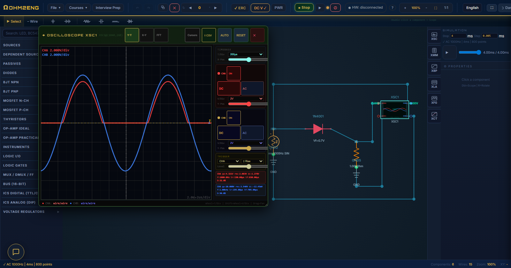
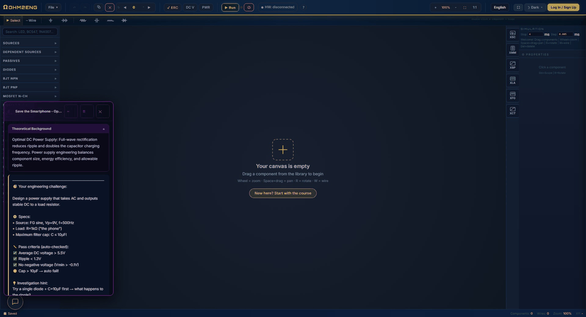
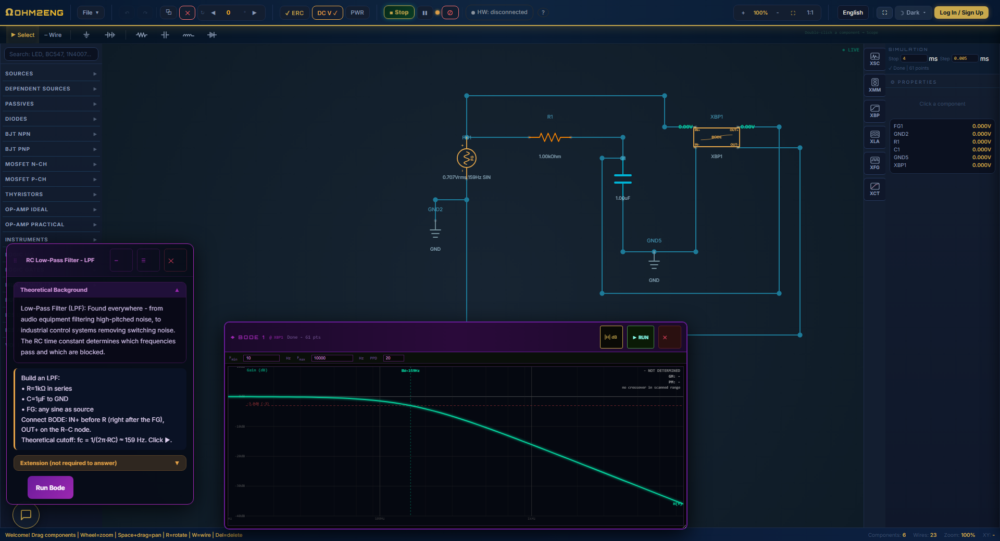
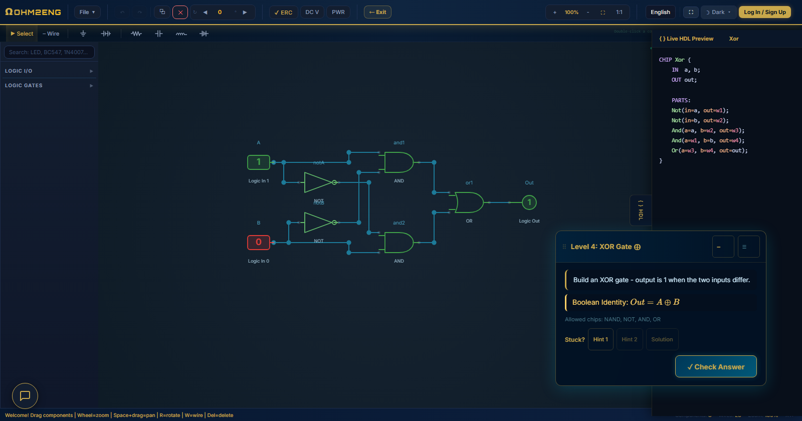
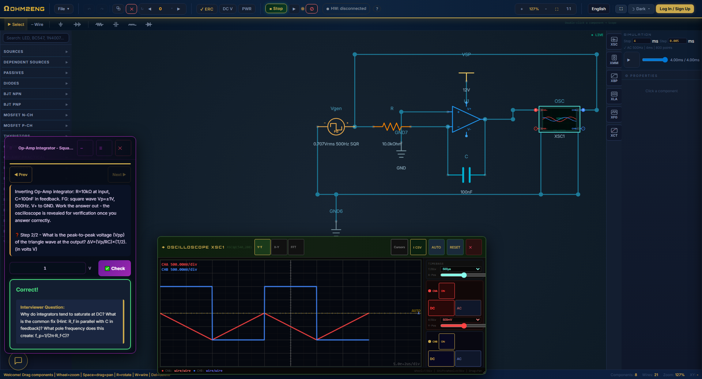

# OHM2ENG

> A browser-based electrical circuit simulator with a deep, interactive education layer.
> **Draw a circuit → press Run → get real DC / AC / transient / Bode / sweep results** - plus full engineering & computer-science courses built on real emulators, and an optional USB bridge that answers the very same exercise from a real board.

🌐 **Live:** [ohm2eng.com](https://ohm2eng.com)

*A public overview of OHM2ENG. The full project source is private - access is available on request (see [Status](#status)).*

*A half-wave rectifier running live - the oscilloscope shows the input sine (blue) against the rectified output (red), solved server-side and drawn back in the browser.*

### The whole loop, end to end

*One lab from start to finish. The task asks for a DC power supply; a transformer, a diode bridge, a smoothing capacitor and a load get wired up; **Run** solves the transient server-side; channel B (blue) reads the AC input while channel A (red) reads the rectified, smoothed output; and **Check** grades the circuit against the lab's own pass criteria - average DC above 5.5 V, ripple under 1.3 V, no negative excursion - and explains why it passed. Nothing here is mocked: the 7.23 V average and 0.58 V ripple come out of the solver.*

---

## Purpose

**OHM2ENG exists to be the single place a student needs, instead of a dozen scattered tools.**

The philosophy is *learn by doing, then get verified*. Every exercise ends in a grade produced by running the student's own work - solving their circuit, or executing their code - never by matching it against a stored answer.

A teaching platform first, and a serious circuit simulator second.

---

## What is this?

OHM2ENG does two big things in the browser, and a third that reaches outside it:

1. **Analog + digital circuit simulator.** Place components on an HTML5 canvas - resistors, transistors, op-amps, sources, logic gates, ICs - wire them up, hit **Run**, and read results back through real virtual instruments: **oscilloscope, multimeter, Bode plotter, logic analyzer, curve tracer**.

*A guided lab: build an RC low-pass filter, then run an AC sweep on the Bode plotter and watch the gain roll off past its ~159 Hz cutoff - the task panel gives you the theory and checks your circuit.*

2. **An electrical-engineering & CS learning platform.** A 16-lecture digital-circuits course; a comprehensive **computer-architecture course** whose *first part* is building a working computer from a single NAND logic gate up (through **Hack**, a **VM**, and a **Jack compiler**), and which then goes well beyond that foundation into **RISC-V, datapath & control, pipelining, caches, and virtual memory** - with genuine emulators at every layer.

   Chip levels are *drawn*; from project 4 on they are *written* - the student types real **Hack assembly** and later **RISC-V**, and the emulator runs the program to decide whether it passed.

   Alongside it: **job-interview prep** (a career center of graded EE/CS questions); and interactive labs - all wrapped in a Leitner **spaced-repetition** scheduler, cloud progress sync, and plan tiers (Guest / Pro).

*The computer-architecture course in action: build an XOR gate from NOT / AND / OR primitives, watch the live HDL preview write the `CHIP Xor` definition as you wire it, then have it graded against its full truth table - one step on the path from a single logic gate up to a working CPU.*

*Interview prep, graded. An op-amp integrator fed a square wave: the question asks for the time constant, then for the peak-to-peak swing of the output - and the oscilloscope stays **hidden** while you answer, so the numbers have to be derived rather than read off. Answer both correctly and the scope opens on the triangle wave you just predicted, followed by the interviewer's next question.*

---

## The core idea: thin client, the server does the math

The single most important architectural fact:

> **All numeric simulation (DC / AC / transient / Bode / sweep) runs server-side** in a Cloudflare Worker.
> The browser does **not** solve circuits - it draws, edits, and `POST`s to `/simulate`.

The solver is a dense **Modified Nodal Analysis (MNA)** engine with **Newton-Raphson** iteration and full device models, given a bounded CPU budget on the Worker. Purely digital circuits are the exception - they evaluate client-side (boolean logic, no differential equations to solve).

**→ For a deeper look at the design, read [ARCHITECTURE.md](ARCHITECTURE.md).**

---

## Optional: solve the same exercise on real hardware

Every exercise is fully solvable in simulation, and always will be. But a student who wants to can **build the circuit on a breadboard**, plug a small USB measurement card into the computer, and answer the *same* task with *real* measurements.

The point is that nothing about the exercise changes. The grader does not know which arena it is in: a real measurement is fed into the exact context the checker already consumes, so the same question, checked the same way, is now answered by a physical circuit. There is also a **compare** view that plots the simulated and measured waveforms on one shared axis and names the difference - gain, offset, or genuine shape - which is where the interesting learning actually happens.

Design rules worth stating: the bridge **informs, it never locks** (no exercise becomes unsolvable without a board); the instrument is treated as **untrusted input** and validated at one boundary; trusting a measurement requires a **three-step calibration** proved against a reference on the card itself, not against the student's own wiring; and the whole feature stays **hidden from students who have never connected a board**, so nobody meets it before it means anything to them.

---

## Tech stack

| Layer | Technology |
|-------|-----------|
| **Client** | Vanilla ES6 modules + HTML5 Canvas (no framework) |
| **Server** | Cloudflare Worker - Hono framework, TypeScript |
| **Solver** | Dense MNA + Newton-Raphson (~7,000 lines, isomorphic client/server) |
| **Hosting** | Cloudflare Pages + Worker |
| **i18n** | Hebrew / English |

---

## Highlights

- **173 components** across **19 categories** in the parts library
- Real device physics: BJT (Ebers-Moll), MOSFET (Shichman-Hodges), diodes, thyristors, op-amps (soft-saturation + oscillator modes)
- Draggable virtual instruments with FFT, Bode, and cursor measurements
- **Comprehensive computer-architecture course** - its first part builds a computer from a single NAND gate up (Hack / VM / Jack), then it extends well beyond into RISC-V, datapath & control, pipelining, caches, and virtual memory; student code is actually executed and graded, not pattern-matched
- **Job-interview prep** - a career center of graded EE/CS questions
- **Optional hardware bridge** - build the circuit for real, read it over USB, and answer the same graded exercise with real measurements; a compare view puts the simulated and measured waveforms on one axis
- **3,600+ automated tests** - unit, Worker route, and browser end-to-end
- SPICE netlist import / export
- Electrical Rule Check (ERC)
- Spaced-repetition mastery tracking + two-way cloud progress sync

---

## Try it

It's **live and free to start** - open **[ohm2eng.com](https://ohm2eng.com)** in any browser, with nothing to install. Jump straight in as a guest, or create an account to save your progress across devices and follow the full course tracks. Works on desktop and tablet, in English or Hebrew.

---

## Status

> **This repository is only a condensed overview - a summary of what OHM2ENG is.**
> The **complete project**, documented in far greater detail, lives in a separate **private repository**: the full source code (client, Cloudflare Worker solver, all course content and emulators), the in-depth engineering handbook, the CI pipeline, and the full test suites - everything. Access to the full private repository can be granted on request - feel free to reach out (for example, via LinkedIn).

The application is live at **[ohm2eng.com](https://ohm2eng.com)** - no setup required. This is a proprietary project - see [LICENSE](LICENSE).

© OHM2ENG. Built with vanilla ES6, HTML5 Canvas, and Cloudflare Workers.
